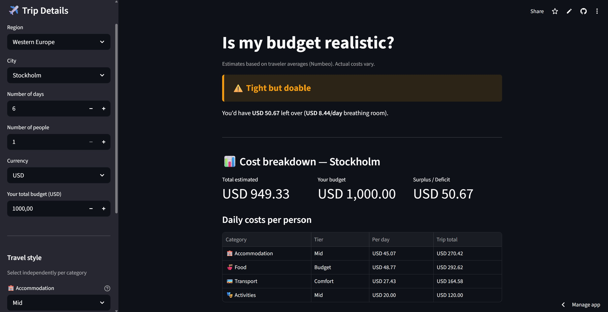
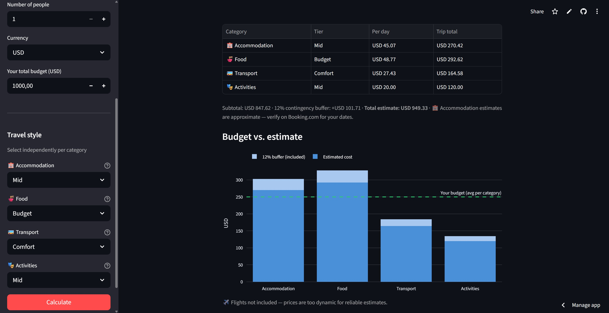
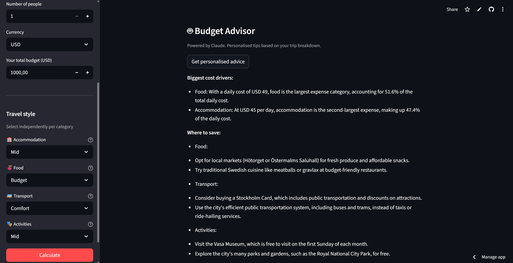

# ✈️ Travel Budget Planner

**"Is my travel budget realistic?"** — answered in under 30 seconds.

🔗 **[Live app → travel-budget-planner.streamlit.app](https://travel-budget-planner.streamlit.app/)**

---

## The problem

Planning a trip budget means opening 5 separate tabs — one for accommodation, one for food, one for transport, one for activities, one for currency conversion. None of them talk to each other, and none of them give you a straight answer about whether your budget is actually enough.

This app fixes that. One input form. One structured cost breakdown. One clear verdict.

---

## Screenshots

### Budget verdict


### Cost breakdown


### AI budget advisor


---

## The differentiator

Every existing free travel budget tool gives you one travel style at a time — budget *or* mid-range *or* comfort. This app lets you **mix tiers independently per category**, which is how real travelers actually plan:

| Category | Budget | Mid | Comfort |
|---|---|---|---|
| 🏨 Accommodation | Hostel / cheap guesthouse | 3-star hotel / Airbnb private room | 4-star hotel |
| 🍜 Food | Street food / self-catering | Mix of mid-range restaurants | Restaurants daily + nicer dinners |
| 🚌 Transport | Public transit only | Transit + occasional taxi | Taxis / rideshare regularly |
| 🎭 Activities | Free sights only | Some paid attractions | Tours + paid experiences daily |

Want budget food, mid-range accommodation, and no paid activities? You can do that. No other free tool offers this level of granularity.

---

## Features

- **100 cities across 8 regions** — Western & Eastern Europe, Southeast Asia, East Asia, Middle East & Turkey, Americas, South Asia, Africa & Oceania
- **Per-category tier mixing** — independent budget/mid/comfort selection per category
- **Verdict banner** — Comfortable ✅ / Tight but doable ⚠️ / You'll run out by day X ❌
- **Surplus/deficit breakdown** — exact leftover per day so you know your breathing room
- **12% contingency buffer** — automatically added to all estimates
- **Live currency conversion** — 150+ currencies via exchangerate-api.com
- **AI budget advisor** — powered by Groq (Llama 3.1 8B), generates destination-specific saving tips and cheaper alternative destinations if budget is tight
- **Interactive Plotly chart** — estimated cost vs. budget visualised per category
- **Automated monthly data refresh** — GitHub Actions scrapes fresh Numbeo data on the 1st of every month

---

## Data strategy

### Why I scrape instead of using the API

Numbeo is the best source of crowdsourced, continuously updated travel cost data covering thousands of cities globally. Their paid API costs $50–500/month — not feasible as a student building a portfolio project. Instead, I built a Python scraper using `requests` and `BeautifulSoup` that pulls public city pages and stores the data locally as a CSV.

### How the data pipeline works

```
pipeline.py
     ↓
numbeo_raw.csv          ← raw scraped prices in local currencies
     ↓
numbeo_clean_usd.csv    ← cleaned, parsed, converted to USD
     ↓
numbeo_tiers_usd.csv    ← daily cost per category per tier, ready for the app
```

### Automated monthly refresh

A GitHub Actions workflow runs on the 1st of every month (with retry runs on the 2nd and 3rd in case of rate limiting). It:
1. Scrapes all 100 cities from Numbeo
2. Cleans and converts prices to USD using live exchange rates
3. Calculates daily costs per tier
4. Commits the updated CSVs back to the repo
5. Streamlit Cloud picks up the new data automatically

The scraper includes resume logic — if Numbeo rate-limits mid-run, progress is saved city by city and the next scheduled run picks up where it left off.

### Exchange rates

Live rates are fetched from [exchangerate-api.com](https://exchangerate-api.com) free tier at scrape time, so currency conversions always reflect current rates rather than hardcoded values.

---

## Tech stack

| Layer | Tool | Notes |
|---|---|---|
| App framework | Streamlit | Pure Python, free deployment |
| Data wrangling | pandas | Core data layer |
| Scraping | requests + BeautifulSoup | Numbeo city pages |
| Visualisations | Plotly | Interactive bar chart |
| Currency conversion | exchangerate-api.com | Free tier, live rates |
| AI advisor | Groq API — Llama 3.1 8B | Free tier, no data training |
| Automation | GitHub Actions | Monthly scrape + commit |
| Deployment | Streamlit Community Cloud | Free, always-on public URL |
| Version control | GitHub | — |

---

## Project structure

```
travel-budget-planner/
├── .github/
│   └── workflows/
│       └── monthly_scrape.yml   # GitHub Actions automation
├── data/
│   ├── numbeo_raw.csv           # Raw scraped data
│   ├── numbeo_clean_usd.csv     # Cleaned, USD-converted data
│   └── numbeo_tiers_usd.csv     # Final tier costs (used by app)
├── notebooks/
│   └── data_exploration.ipynb  # EDA, tier formula development
├── screenshots/
│   ├── verdict_banner.jpg
│   ├── cost_breakdown.jpg
│   └── ai_advisor.jpg
├── app.py                       # Streamlit UI
├── cost_calculator.py           # Cost estimation and verdict logic
├── llm_advisor.py               # AI budget advisor (Groq)
├── pipeline.py                  # Full scrape → clean → transform pipeline
├── requirements.txt
└── README.md
```

---

## Run locally

```bash
git clone https://github.com/elzacapar/travel-budget-planner
cd travel-budget-planner
pip install -r requirements.txt
```

Create a `.env` file:
```
GROQ_API_KEY=your_key
EXCHANGERATE_API_KEY=your_key
```

```bash
streamlit run app.py
```

To run the full data pipeline manually:
```bash
python pipeline.py
```

---

## Known limitations

- Estimates are based on crowdsourced traveler averages from Numbeo — actual costs vary, especially for accommodation
- Data is refreshed monthly — prices may shift with inflation, seasonality, or world events between updates
- Accommodation estimates use apartment rental proxies scaled by multipliers — always verify on Booking.com for your specific dates
- Flights are excluded — too dynamic for reliable estimates
- Luxury tier excluded — insufficient data quality on Numbeo for consistent estimates across all cities
- Buenos Aires prices are stored in USD on Numbeo due to Argentina's currency situation — estimates may be less reliable

---

## Origin story

Built from personal experience. I frequently plan trips across Southeast Asia and Europe on a student or tight budget. The frustration of opening 5 separate tabs every time I wanted to estimate a trip was the problem. This app solves it in under 30 seconds.

The per-category tier mixing came from a real planning need — I'm okay with buying cheaper food but I'm willing to pay for a decent private room. No existing free tool let me express that. Now one does.

---

## Author

**Elza Capar** — Data Science student at EC Utbildning, Sweden.

[LinkedIn](https://www.linkedin.com/in/elzacapar/) · [GitHub](https://github.com/elzacapar) · [Live app](https://travel-budget-planner.streamlit.app/)
